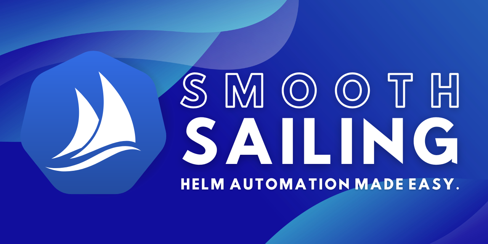

# SmoothSailing
 [](https://www.nuget.org/packages/SmoothSailing/)
 
A library to support Helm Chart installation in Kubernetes cluster from .NET code



## How to install
`SmoothSailing` is distribute as a nuget package [SmoothSailing](https://www.nuget.org/packages/SmoothSailing/)

## Sample usage

```cs
var chartInstaller = new ChartInstaller(new ProcessLauncher());
await using var release = await chartInstaller.Install
(
    chart: new ChartFromLocalPath("./charts/mysamplechart"),
    releaseName: "samplerelease",
    overrides: new {
        sample_property = "sample_value"
    },
    timeout: TimeSpan.FromMinutes(2)
);
```

## Packing helm chart into nuget package

1. Add your Helm Charts into `charts/` directory in your project
2. Edit project file to include all chart's file as `Content` in your nuget package
  ```xml
  <ItemGroup>
    <Content Include="charts/**/*.yaml">
      <CopyToOutputDirectory>Always</CopyToOutputDirectory>
      <PackageCopyToOutput>true</PackageCopyToOutput>
    </Content>
  </ItemGroup>
  ```
 
3. Make sure that all `yaml` files are encoded as `UTF-8` not `UTF-8-BOOM`


## SmoothSailing.MsSql

Setup MsSql for tests.

Built on top of helm chart provided by https://github.com/microsoft/mssql-docker/tree/master/linux/sample-helm-chart

```cs
[Test]
public async Task install_mssql()
{
    var chartInstaller = new ChartInstaller(new ProcessLauncher());
    await using var release = await chartInstaller.Install
    (
        chart: new ChartFromLocalPath("./charts/mssql"),
        releaseName: "samplerelease",
        overrides: new MsSqlConfiguration
        {
            ServicePort = 1433,
            SaPassword = "StrongPass1!"
        },
        timeout: TimeSpan.FromMinutes(2)
    );

    var localPort= await release.StartPortForwardForService("samplerelease-mssql-latest", servicePort: 1433);
    Console.WriteLine($"SqlServer available at {localPort}");
}
```